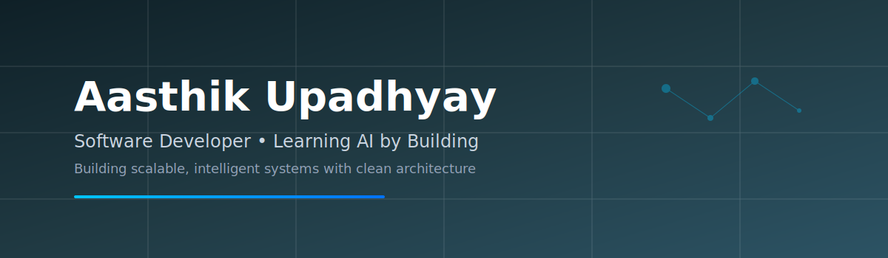

  

<picture>
  <source media="(prefers-color-scheme: dark)" srcset="https://raw.githubusercontent.com/Aasthik17/Aasthik17/output/github-contribution-grid-snake-dark.svg" />
  
</picture>

<!-- ===== PROFILE HEADER ===== -->
<h1 align="center">Hi 👋, I'm Aasthik Upadhyay</h1>
<h3 align="center">Software Developer</h3>

  
  
  

<!-- 

  

 -->

---

## 👨‍💻 About Me

I’m a **Software Developer** and **Computer Science (AIML)** undergraduate at **UPES, Dehradun**, driven by building **scalable, real-world systems** at the intersection of **AI, backend engineering, and cloud platforms**.

I enjoy working on:
- AI-powered applications (RAG, ML pipelines, edge inference)
- Backend & distributed systems
- Clean architecture and production-ready codebases

🎓 **B.Tech CSE (AIML)** - *CGPA: 9.48 / 10*  
🏆 Multiple **state-level hackathon wins** & national-level project presentations

---

## 🛠️ Tech Stack

### 💻 Languages

### ⚙️ Frameworks & Platforms

### 🗄️ Databases

### 🧰 Developer Tools

---

## 🚀 Featured Projects

### 🔹 Real-Time AQI Monitoring System
**Tech:** Jetson Nano · Python · IoT Sensors · LSTM · ONNX  
- Edge-based air quality monitoring with on-device ML inference  
- Reduced cloud dependency & improved latency  
- 🏆 **State Winner - Udbhav Hackathon 2025**  
- Felicitated at **Raj Bhavan (Govt. of Uttarakhand)**

---

### 🔹 [CareerPath AI](https://github.com/Aasthik17/career-path-ai)
**Tech:** Amazon Bedrock · RAG · Next.js · TypeScript · AWS Lambda  
End-to-end, agent-driven RAG system for explainable career guidance. Includes a Next.js frontend, serverless Python/TypeScript lambdas, and an AWS-backed knowledge base and embedding pipeline. Built with production patterns (infrastructure-as-code, modular backend lambdas) - showcased at HackVeda (IBM & AWS-sponsored).  
Repo: https://github.com/Aasthik17/career-path-ai

---

### 🔹 [ExpenseEase](https://github.com/Aasthik17/ExpenseEase)
**Tech:** Flutter · Dart · Node.js (Express) · Python (TesseractOCR) · MySQL  
OCR-powered personal finance mobile app that scans bills/receipts and auto-categorizes expenses. Features expense history, visual summaries, reminders, and an OCR service to extract printed/handwritten text. Recognized for usability and potential IP/innovation.  
Repo: https://github.com/Aasthik17/ExpenseEase

---

### 🔹 [CSES Problem Set — Solutions](https://github.com/Aasthik17/cses-problem-set-answers)
**Tech:** Java (primary)  
A curated, in-progress collection of solutions to the CSES Problem Set — useful for DSA practice and interview preparation. Organized into problem categories (sorting & searching, DP, graph algorithms, mathematics, strings, etc.).  
Repo: https://github.com/Aasthik17/cses-problem-set-answers

---

### 🔹 [YouTube Playlist Checker (Browser Extension)](https://github.com/Aasthik17/youtube-playlist-checker)
**Tech:** JavaScript · CSS · Browser Extensions (Chromium & Firefox)  
Lightweight extension that adds an interactive checklist to YouTube playlist pages so you can track watched videos. Works on Firefox (published) and Chromium-based browsers (manual install). Features persistent progress via browser storage and a floating UI to improve learning/playback workflows.  
Repo: https://github.com/Aasthik17/youtube-playlist-checker

---

## 🏅 Achievements & Leadership

- 🥇 **1st Prize** - State Foundation Silver Jubilee Celebration  
- 🏆 **State Winner** - Udbhav Hackathon 2025  
- 👥 **Joint Secretary, CSI UPES**  
  - Organized technical workshops & hackathons for **200+ students**
  - Bridged collaboration between students, faculty & industry mentors

---

## 📫 Let’s Connect

- 📧 **Email:** aasthik.work08@gmail.com  
- 💼 **LinkedIn:** [Aasthik Upadhyay](https://www.linkedin.com/in/aasthik-upadhyay-0a5730213/)  
- 🧠 **LeetCode:** [Aasthik17](https://leetcode.com/u/Aasthik17/)

---

  <i>Building software that scales, learns, and makes impact.</i>

